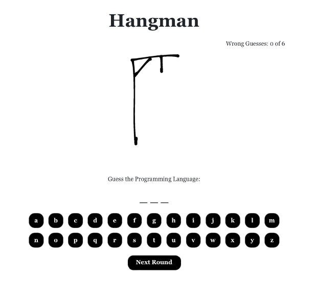

This project, **HangOrSurvive** targets users who are fond of playing hangman and have knowledge of the different types of programming languages. Each user is allowed to do the stipulated actions as stated below. 

|               |  Description  |
| ------------- | ------------- |
|     User      | Able to guess the letters of the chosen programming languages by clicking on the keys  |
| Content Cell  | Able to skip to another round if he/she gives up on trying that specific round  |

This project was bootstrapped with [Create React App](https://github.com/facebook/create-react-app). In addition, there were icons utilized from [React-Icons](https://react-icons.github.io/react-icons/). 

# Getting Started with HangOrSurvive
Step 1: Download the file and unzip it.

Step 2: Open up the file in Visual Studio Code.

Step 3: You will need to ensure that you have both npx and Node.js installed. After which, you can access the file with Visual Studio Code.

Step 4: In the main project directory, enter the following command in the terminal of Visual Studio Code.
> npm install

Step 5: Once the installation has been completed, you can proceed to enter the following command to run the application.
> npm run start

Step 6: You may access the application through http://localhost:3000/.

# How to Use the Application 
The user will be directed to this page upon running the application successfully. If not, the user may access the application through http://localhost:3000/.

Based on the chosen programming language that has been randomly picked by an algorithm. It will display the number of letters (not unique) of that programming language. (e.g., CSS has 3 letters)

The user will have to make a guess and click on the respective letters. If the user would like to skip this round, the user can proceed to click on “Next Round”.

Upon making the correct guess, the key will be faded and the correct letter will be displayed above.

Based on the display, the user can continue to analyze and think of any relevant programming language.

However, if the user made a wrong guess and clicked on the wrong letter. There will be a new stroke shown and be counted in the wrong guesses.

Upon making the correct guess, it displays “You won!!!”.

Upon making the wrong guess, it displays “Better luck next time!”.

If the user would like to proceed to the next round. The user can click on the button “Next Round”.

------------- ------------- ------------- ------------- ------------- ------------- ------------- ------------- ------------- ------------- 

# Getting Started with Create React App

This project was bootstrapped with [Create React App](https://github.com/facebook/create-react-app).

## Available Scripts

In the project directory, you can run:

### `npm start`

Runs the app in the development mode.\
Open [http://localhost:3000](http://localhost:3000) to view it in your browser.

The page will reload when you make changes.\
You may also see any lint errors in the console.

### `npm test`

Launches the test runner in the interactive watch mode.\
See the section about [running tests](https://facebook.github.io/create-react-app/docs/running-tests) for more information.

### `npm run build`

Builds the app for production to the `build` folder.\
It correctly bundles React in production mode and optimizes the build for the best performance.

The build is minified and the filenames include the hashes.\
Your app is ready to be deployed!

See the section about [deployment](https://facebook.github.io/create-react-app/docs/deployment) for more information.

### `npm run eject`

**Note: this is a one-way operation. Once you `eject`, you can't go back!**

If you aren't satisfied with the build tool and configuration choices, you can `eject` at any time. This command will remove the single build dependency from your project.

Instead, it will copy all the configuration files and the transitive dependencies (webpack, Babel, ESLint, etc) right into your project so you have full control over them. All of the commands except `eject` will still work, but they will point to the copied scripts so you can tweak them. At this point you're on your own.

You don't have to ever use `eject`. The curated feature set is suitable for small and middle deployments, and you shouldn't feel obligated to use this feature. However we understand that this tool wouldn't be useful if you couldn't customize it when you are ready for it.

## Learn More

You can learn more in the [Create React App documentation](https://facebook.github.io/create-react-app/docs/getting-started).

To learn React, check out the [React documentation](https://reactjs.org/).

### Code Splitting

This section has moved here: [https://facebook.github.io/create-react-app/docs/code-splitting](https://facebook.github.io/create-react-app/docs/code-splitting)

### Analyzing the Bundle Size

This section has moved here: [https://facebook.github.io/create-react-app/docs/analyzing-the-bundle-size](https://facebook.github.io/create-react-app/docs/analyzing-the-bundle-size)

### Making a Progressive Web App

This section has moved here: [https://facebook.github.io/create-react-app/docs/making-a-progressive-web-app](https://facebook.github.io/create-react-app/docs/making-a-progressive-web-app)

### Advanced Configuration

This section has moved here: [https://facebook.github.io/create-react-app/docs/advanced-configuration](https://facebook.github.io/create-react-app/docs/advanced-configuration)

### Deployment

This section has moved here: [https://facebook.github.io/create-react-app/docs/deployment](https://facebook.github.io/create-react-app/docs/deployment)

### `npm run build` fails to minify

This section has moved here: [https://facebook.github.io/create-react-app/docs/troubleshooting#npm-run-build-fails-to-minify](https://facebook.github.io/create-react-app/docs/troubleshooting#npm-run-build-fails-to-minify)
